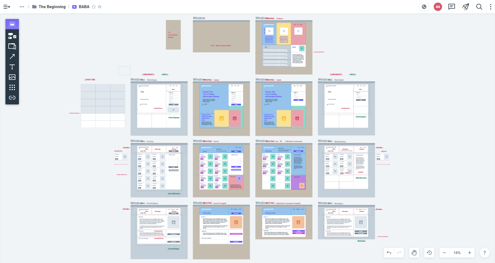

 

## **recipes outloud** 
 

[https://obscure-wave-54940.herokuapp.com/](https://obscure-wave-54940.herokuapp.com/) 

Project 3 - Team BABA 

Broc Crook, [https://github.com/bac5806](https://github.com/bac5806) 
Abner Toribio-Vazquez, [https://github.com/AbnerTor](https://github.com/AbnerTor) 
Brian McMullen, [https://github.com/MrBmmc](https://github.com/MrBmmc) 
Ali Aran, [https://github.com/AranATA](https://github.com/AranATA) 
 

## description

***
As an avid cook; I want to interact with other people, share my recipes, my creations and discover new ones too. Recipes Outloud aims to bring these people together and equip them with various tools to achieve this goal and make cooking more fun then ever! 
Recipes Outloud App answers these need and presents an easy to use UI. The app was developed using the MERN stack with a React front end, MongoDB database, and Node.js/Express.js server and API. It's already set up to allow users to save book searches to the back end. The app was deployed to Heroku through MongoDB Atlas.  
 
 

## acceptance criteria

***

GIVEN a Recipes Outloud App: 

* WHEN ...; THEN ... . 
 
 

## usage

***

Screenshot that shows the app's wireframe: 
 

 
 

Screenshot that shows the full generated web page: 
 

 
 
 

## some valuable references

***

These notes and links are listing some valuable references among others that we used doing this project: 
 

[https://www.apollographql.com/docs/react/local-state/local-state-management/](https://www.apollographql.com/docs/react/local-state/local-state-management/)

[https://www.apollographql.com/docs/apollo-server/security/authentication/](https://www.apollographql.com/docs/apollo-server/security/authentication/)

[https://www.howtographql.com/basics/1-graphql-is-the-better-rest/](https://www.howtographql.com/basics/1-graphql-is-the-better-rest/)

[https://graphql.org/blog/rest-api-graphql-wrapper/](https://graphql.org/blog/rest-api-graphql-wrapper/)

[https://www.mongodb.com/cloud/atlas](https://www.mongodb.com/cloud/atlas)

[https://blog.logrocket.com/how-react-hooks-can-replace-react-router/](https://blog.logrocket.com/how-react-hooks-can-replace-react-router/)

 
 

## credits

***

Stephen Woosley - Bootcamp Instructor 
Patrick Haberern - Bootcamp TA 
Tim Nagorski - Bootcamp TA 
Sean Walmer - Bootcamp TA 
 
 

## license

***

This is a project done under a bootcamp program.
 
 

## badges

***

 
 
